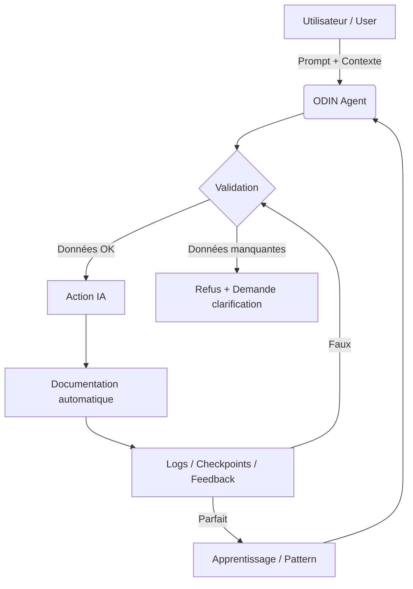

# ODIN – Agent IA Autonome pour la Connaissance Universelle / Autonomous AI Agent for Universal Knowledge
**Par / By Julien Gelee aka Krigs**

[](https://opensource.org/licenses/MIT)
[](https://github.com/krigs/odin/actions)
[](https://github.com/krigs/odin/coverage)
[](https://github.com/krigs/odin)

---

## 🇫🇷 Présentation / 🇬🇧 Introduction

> **ODIN** (pour "connaissance universelle") est un projet open source né de 6 mois de travail intensif (parfois 17h/jour !), pensé, codé et documenté par moi, **Julien Gelee aka Krigs**. Son but : rendre l’IA accessible à tous, même sans savoir coder, en injectant un système de prompts hybrides et de gestion de contexte directement dans l’IDE.
>
> **ODIN** (for "universal knowledge") is an open-source project born from 6 months of intense work (sometimes 17h/day!), designed, coded, and documented by me, **Julien Gelee aka Krigs**. Its goal: make AI accessible to everyone, even non-coders, by injecting a hybrid prompt and context system directly into the IDE.

**Si ce travail vous inspire, laissez une étoile sur GitHub ! / If you appreciate this work, leave a star on GitHub!** ⭐️

---

## 🏅 Badges supplémentaires / Extra Badges

[](https://github.com/krigs/odin/issues)
[](https://github.com/krigs/odin/pulls)
[](https://github.com/krigs/odin/commits)

---

## 🧠 Pourquoi ODIN ? / Why ODIN?

- **Référence à la connaissance universelle** : ODIN, dieu de la sagesse, symbolise l’ambition de rendre le savoir et la puissance de l’IA accessibles à tous.
- **Hybrid Prompt & Context** : Un système qui combine prompts structurés et gestion contextuelle pour guider l’IA, éviter les dérives, et garantir la cohérence du projet.
- **Pensé pour l’IDE** : ODIN s’intègre à la racine de n’importe quel projet, dans n’importe quel IDE, pour servir de socle à vos interactions IA.
- **Partage sincère** : Ce projet est le fruit d’un travail de terrain, sans promesse miracle, mais avec une exigence de robustesse, de documentation et d’accessibilité.

- **Reference to universal knowledge**: ODIN, god of wisdom, symbolizes the ambition to make knowledge and AI power accessible to all.
- **Hybrid Prompt & Context**: A system combining structured prompts and contextual management to guide AI, avoid drifts, and ensure project coherence.
- **IDE-centric**: ODIN integrates at the root of any project, in any IDE, as a foundation for your AI interactions.
- **Sincere sharing**: This project is the result of hands-on work, with no miracle promises, but with a demand for robustness, documentation, and accessibility.

---

## ✨ Philosophie et Mission / Philosophy & Mission

> Ce projet n’est ni une promesse, ni une solution miracle. C’est le fruit d’un travail de terrain, en solitaire, que je souhaite partager sans prétention. L’idée : permettre à l’IA de fonctionner quasi seule, de s’auto-corriger, s’auto-documenter, et de minimiser ses erreurs via une boucle de vérification systématique.
>
> This project is neither a promise nor a miracle solution. It’s the result of hands-on, solitary work that I wish to share humbly. The idea: let AI work almost autonomously, self-correct, self-document, and minimize errors through a systematic verification loop.

---

## 🏗️ Fonctionnalités Clés / Key Features

- **Prompts structurés et multirègles** (anti-biais, anti-hallucination, rollback, synchronisation doc/code)
- **Gestion avancée du contexte** (mémoire persistante, pruning, validation contextuelle)
- **Auto-correction et apprentissage** (logs, patterns, anti-patterns, feedback "Faux/Parfait")
- **Extension Chrome** (injection de prompts dans ChatGPT, Gemini, Claude…)
- **Sécurité & RGPD** (aucune donnée externe, logs locaux, conformité)
- **Documentation automatique** (toutes les actions tracées, synchronisation obligatoire)
- **Prêt à l’emploi pour non-développeurs** (aucune compétence technique requise pour démarrer)

- **Structured, multi-rule prompts** (anti-bias, anti-hallucination, rollback, doc/code sync)
- **Advanced context management** (persistent memory, pruning, contextual validation)
- **Self-correction and learning** (logs, patterns, anti-patterns, "Faux/Parfait" feedback)
- **Chrome extension** (prompt injection into ChatGPT, Gemini, Claude…)
- **Security & GDPR** (no external data, local logs, compliance)
- **Automatic documentation** (all actions traced, mandatory sync)
- **Ready for non-developers** (no technical skills required to start)

---

## 🖼️ Captures d’écran / Screenshots

### 🇫🇷 Ajoutez vos captures d’écran ici pour illustrer l’interface, l’extension, ou l’utilisation d’ODIN.
### 🇬🇧 Add your screenshots here to showcase the interface, extension, or ODIN usage.


*Exemple d’utilisation dans VSCode (FR) / Example usage in VSCode (EN)*


*Extension Chrome ODIN (FR/EN)*

---

## 🖼️ Schéma d’architecture / Architecture Diagram



---

## 📚 Documentation complète / Full Documentation

- [docs/00_PROJECT_EVOLUTION.md](docs/00_PROJECT_EVOLUTION.md) – 🇫🇷🇬🇧 Histoire, philosophie, algorithmes, étude du dossier prompts, esprit du projet, etc.
- [exemple/README.md](exemple/README.md) – 🇫🇷🇬🇧 Exemple complet d’utilisation, procédure autonome, fichiers générés, feedback, apprentissage.

---

## 🚀 Exemple d'utilisation / Usage Example

Un dossier `exemple/` est fourni pour illustrer comment démarrer un projet ODIN, structurer un prompt, et obtenir une interaction robuste et documentée avec l'IA.

A folder `exemple/` is provided to show how to start an ODIN project, structure a prompt, and get a robust, documented interaction with the AI.

### 🇫🇷 Procédure autonome ODIN / 🇬🇧 ODIN Autonomous Procedure

- **Checkpoints IA (`AI_CHECKPOINT.json`)** : Sauvegarde automatique de l'état, des feedbacks, des patterns de réussite et d'échec, et du contexte courant.
- **Backup régulier (`AI_CHECKPOINT.bak.json`)** : Copie de sécurité automatique pour restaurer l'état en cas de problème.
- **Journal d'apprentissage (`learning_log.json`)** : Historique détaillé de chaque session, feedback utilisateur ("Faux" ou "Parfait"), actions prises, analyse d'erreur, patterns appris.
- **Feedback binaire** : Après chaque action, l'utilisateur donne un feedback "Faux" (correction immédiate, apprentissage) ou "Parfait" (validation, documentation, passage à l'étape suivante).
- **Auto-correction** : En cas de "Faux", l'IA analyse l'erreur, applique une correction, et met à jour ses patterns.
- **Documentation automatique** : Chaque action, correction, ou rollback est tracé dans les logs.

#### 📂 Exemples de fichiers générés / Example of generated files

- [`exemple/AI_CHECKPOINT.json`](exemple/AI_CHECKPOINT.json) : Checkpoint principal
- [`exemple/AI_CHECKPOINT.bak.json`](exemple/AI_CHECKPOINT.bak.json) : Backup automatique
- [`exemple/learning_log.json`](exemple/learning_log.json) : Journal d'apprentissage détaillé

---

## 🗂️ Structure du Projet / Project Structure

```text
/
├── agent/             # Scripts pour l'agent local (cryptage, etc.) / Local agent scripts (encryption, etc.)
├── docs/              # Documentation détaillée / Detailed documentation
├── extension/         # Extension Chrome / Chrome extension
├── prompts/           # Prompts structurés / Structured prompts
│   ├── economic_models/ # Modèles économiques / Economic models
├── exemple/           # Exemples d'utilisation ODIN / ODIN usage examples
├── .gitignore         # Fichiers ignorés / Ignored files
├── LICENSE            # Licence / License
└── README.md          # Présentation générale / General overview
```

---

## 🇫🇷 Comment démarrer ? / 🇬🇧 Getting Started

1. **Clonez le dépôt / Clone the repo**  
   `git clone [URL_DU_REPO_GITHUB]`
2. **Ouvrez dans votre IDE / Open in your IDE**  
   VSCode, Cursor, etc.
3. **(Optionnel) Installez l’extension Chrome / (Optional) Install the Chrome extension**
4. **Utilisez les prompts du dossier `/prompts` / Use the `/prompts` folder prompts**
5. **Testez les exemples du dossier `/exemple` / Try the `/exemple` folder examples**
6. **Laissez une étoile si ce travail vous aide ! / Leave a star if this work helps you!** ⭐️

---

## ❓ FAQ

### 🇫🇷 Questions fréquentes

**Q : ODIN fonctionne-t-il hors ligne ?**
> Oui, ODIN est conçu pour fonctionner avec des modèles locaux et sans dépendance à des ressources externes.

**Q : Puis-je utiliser ODIN sans savoir coder ?**
> Absolument ! Toute la structure est pensée pour guider même les non-développeurs.

**Q : Comment ODIN gère-t-il les erreurs ou les dérives IA ?**
> Par feedback binaire (Faux/Parfait), rollback automatique, et apprentissage continu documenté.

**Q : Puis-je contribuer ou adapter ODIN à mon propre workflow ?**
> Oui, le projet est open source et toute contribution est la bienvenue !

### 🇬🇧 Frequently Asked Questions

**Q: Does ODIN work offline?**
> Yes, ODIN is designed to work with local models and without external dependencies.

**Q: Can I use ODIN without coding skills?**
> Absolutely! The whole structure is designed to guide even non-developers.

**Q: How does ODIN handle errors or AI drifts?**
> Through binary feedback (Faux/Parfait), automatic rollback, and continuous documented learning.

**Q: Can I contribute or adapt ODIN to my own workflow?**
> Yes, the project is open source and all contributions are welcome!

---

## 🤝 Contribution

Ce projet est open source et les contributions sont les bienvenues ! N'hésitez pas à ouvrir une *issue* pour signaler un bug ou proposer une nouvelle fonctionnalité, ou une *pull request* pour contribuer directement au code.

This project is open source and contributions are welcome! Feel free to open an issue to report a bug or suggest a new feature, or a pull request to contribute directly.

---

## 🙏 Remerciements / Acknowledgements

Merci à tous ceux qui croient au partage sincère, à la robustesse, et à l’accessibilité de l’IA pour tous.  
Thanks to all who believe in sincere sharing, robustness, and AI accessibility for everyone.

---

*Julien Gelee aka Krigs – 2025* 