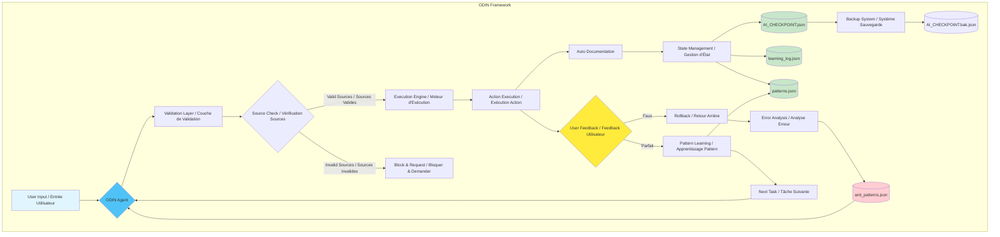

<div align="center">

# 🌟 ODIN: Autonomous AI Agent Framework
### Universal Knowledge for AI-Powered Development

**By Julien Gelee aka Krigs**

[](https://opensource.org/licenses/MIT)
[](https://github.com/Krigsexe/AI-Context-Engineering)
[](https://github.com/Krigsexe/AI-Context-Engineering/actions/workflows/codeql.yml)
[](https://github.com/Krigsexe/AI-Context-Engineering/actions/workflows/bandit.yml)

</div>

<p align="center">
  <strong>🚀 Empowering everyone to build with AI, regardless of technical background</strong>
</p>

<p align="center">
  <a href="QUICKSTART.md"><strong>📖 Quick Start Guide</strong></a> •
  <a href="#-key-features"><strong>✨ Features</strong></a> •
  <a href="docs/PROJECT_PHILOSOPHY.md"><strong>🧠 Philosophy</strong></a> •
  <a href="exemple/"><strong>💡 Examples</strong></a> •
  <a href="CONTRIBUTING.md"><strong>🤝 Contributing</strong></a>
</p>

---

## 📖 What is ODIN?

**ODIN** (named after the Norse god of wisdom and knowledge) is an open-source framework born from 6 months of intensive research and development. It's designed to make AI truly accessible and reliable for everyone - from seasoned developers to creative entrepreneurs with no coding experience.

At its core, ODIN is a sophisticated prompt engineering system that transforms any Large Language Model into an autonomous, self-correcting, and ultra-reliable development assistant. It's not just another AI tool - it's a complete methodology for building production-ready applications with AI.

### 🎯 The Vision

After exploring every possible flaw in generative AI - hallucinations, logical drifts, context loss, and more - I created ODIN to solve a fundamental problem: **How can we make AI work reliably and autonomously while remaining accessible to everyone?**

The answer lies in this framework that combines:
- **Structured prompts** with multi-layered security rules
- **Persistent memory** through checkpoint systems
- **Self-learning capabilities** with pattern recognition
- **Absolute reliability** with zero tolerance for errors

If this work inspires you, **please leave a star on GitHub!** ⭐️

---

## ✨ Key Features

### 🛡️ Security & Reliability First
- **Zero hallucination policy**: Every response must be based on verifiable sources
- **Automatic rollback**: Instant recovery from any error
- **File integrity validation**: Prevents unauthorized modifications
- **Input sanitization**: Protection against malicious inputs

### 🧠 Autonomous Learning System
- **Binary feedback loop**: Simple "Faux/Parfait" (Wrong/Perfect) system
- **Pattern recognition**: Learns from successes and failures
- **Persistent memory**: Maintains context across sessions via checkpoint files
- **Self-documentation**: Every action is automatically documented

### 🔄 Advanced Context Management
- **AI_CHECKPOINT.json**: Main state preservation
- **Automatic backups**: Redundancy through `.bak` files
- **Learning logs**: Complete history of all interactions
- **Smart merging**: Intelligent conflict resolution

### 📚 Documentation Synchronization
- **Mandatory sync**: Code and documentation always stay aligned
- **Duplicate detection**: Prevents documentation drift
- **Automatic updates**: Documentation evolves with the codebase

---

## 🚀 Getting Started / Comment démarrer ?

### 📋 Prerequisites / Prérequis
- **🇬🇧** An AI tool (ChatGPT, Claude, or any local LLM) + Any modern IDE  
- **🇫🇷** Un outil IA (ChatGPT, Claude, ou un LLM local) + N'importe quel IDE moderne  
- **No coding experience required! / Aucune expérience de programmation requise !**

### ⚡ Quick Start / Démarrage rapide

**🇬🇧 English:**
1. **Clone this repository** / **🇫🇷 Clonez ce dépôt** :
   ```bash
   git clone https://github.com/Krigsexe/AI-Context-Engineering.git
   cd AI-Context-Engineering
   ```

2. **Load the ODIN prompt** / **🇫🇷 Chargez le prompt ODIN** :
   - Open `prompts/ODIN.md` / Ouvrez `prompts/ODIN.md`
   - Copy its content to your AI assistant / Copiez son contenu dans votre assistant IA

3. **Start building** / **🇫🇷 Commencez à construire** :
   - Give it a project idea / Donnez-lui une idée de projet
   - Use "Parfait" or "Faux" feedback / Utilisez les feedbacks "Parfait" ou "Faux"
   - Watch the magic happen! / Regardez la magie opérer !

**📖 Need detailed guidance? / Besoin d'un guide détaillé ?**  
👉 **[Complete 5-minute tutorial / Tutoriel complet de 5 minutes](QUICKSTART.md)**

**💡 Want to see examples? / Envie de voir des exemples ?**  
👉 **[Check the `exemple/` folder / Consultez le dossier `exemple/`](exemple/)**

---

## ��️ Project Structure / Structure du Projet

**🇬🇧 The repository is organized for clarity and ease of navigation.**  
**🇫🇷 Le dépôt est organisé pour la clarté et la facilité de navigation.**

```
.
├── .github/                       # GitHub configuration / Configuration GitHub
│   ├── dependabot.yml             # Dependency management (disabled) / Gestion dépendances (désactivé)
│   └── workflows/                 # CI/CD workflows (ready to activate) / Workflows CI/CD (prêts)
├── docs/                          # Detailed documentation / Documentation détaillée
│   ├── assets/                    # Images and visual resources / Images et ressources visuelles
│   └── PROJECT_PHILOSOPHY.md      # The story behind ODIN / L'histoire d'ODIN
├── exemple/                       # Live example of ODIN in action / Exemple concret d'ODIN
│   ├── AI_CHECKPOINT.json         # AI state file / Fichier d'état IA
│   ├── AI_CHECKPOINT.bak.json     # Backup state / Sauvegarde d'état
│   ├── learning_log.json          # Learning history / Historique d'apprentissage
│   └── README.md                  # Example documentation / Documentation exemple
├── prompts/                       # The heart of ODIN / Le cœur d'ODIN
│   ├── archive/                   # Historical versions / Versions historiques
│   ├── ODIN.md                    # Main prompt (v5.1.0) / Prompt principal (v5.1.0)
│   └── README.md                  # Prompt guide / Guide des prompts
├── .gitignore                     # Git ignore rules / Règles Git ignore
├── LICENSE                        # MIT License / Licence MIT
├── README.md                      # You are here / Vous êtes ici
└── SECURITY.md                    # Security policy / Politique de sécurité
```

---

## 🌟 Real-World Applications / Applications Réelles

**🇬🇧 ODIN has already been battle-tested in production environments:**  
**🇫🇷 ODIN a déjà été testé en conditions réelles de production :**

- **🛒 E-commerce Platform / Plateforme E-commerce**: Self-adaptive web hosting solution / Solution d'hébergement web auto-adaptative
- **🎮 GTA RP Server / Serveur GTA RP**: Fully prompt-driven game server / Serveur de jeu entièrement piloté par prompts
- **🎯 Python → Blueprint Converter**: For Unreal Engine 5 development / Pour le développement Unreal Engine 5

**🇬🇧 Each project was developed with minimal human intervention, showcasing ODIN's ability to handle complex, real-world applications.**  
**🇫🇷 Chaque projet a été développé avec une intervention humaine minimale, démontrant la capacité d'ODIN à gérer des applications complexes du monde réel.**

---

## 💡 How It Works / Comment ça fonctionne

<div align="center">



</div>


---

## 🤝 Contributing / Contribuer

**🇬🇧 ODIN is open source and contributions are welcome! Whether you're fixing bugs, improving documentation, or suggesting new features, your input is valuable.**

**🇫🇷 ODIN est open source et les contributions sont les bienvenues ! Que vous corrigiez des bugs, amélioriez la documentation, ou suggériez de nouvelles fonctionnalités, votre contribution est précieuse.**

👉 **[Contributing Guidelines / Guide de Contribution](CONTRIBUTING.md)**

---

## 📚 Documentation

- **🇬🇧🇫🇷 [Project Philosophy / Philosophie du Projet](docs/PROJECT_PHILOSOPHY.md)**: The complete story behind ODIN / L'histoire complète d'ODIN
- **🇬🇧🇫🇷 [Example Usage / Exemple d'Utilisation](exemple/README.md)**: Step-by-step guide with real examples / Guide étape par étape avec exemples réels
- **🇬🇧🇫🇷 [Prompt Documentation / Documentation des Prompts](prompts/README.md)**: Understanding the prompt structure / Comprendre la structure des prompts

---

## 🔒 Security / Sécurité

**🇬🇧 We take security seriously. ODIN is designed with multiple layers of protection against prompt injection, malicious inputs, and unauthorized modifications.**

**🇫🇷 Nous prenons la sécurité au sérieux. ODIN est conçu avec plusieurs couches de protection contre l'injection de prompts, les entrées malveillantes, et les modifications non autorisées.**

👉 **[Security Policy / Politique de Sécurité](SECURITY.md)**

---

## 📄 License / Licence

**🇬🇧 This project is licensed under the MIT License.**  
**🇫🇷 Ce projet est sous licence MIT.**

👉 **[LICENSE](LICENSE)**

---

## 🙏 Acknowledgments / Remerciements

> **🇬🇧** "This project is neither a promise nor a miracle solution. It's the result of hands-on, solitary work that I wish to share humbly. The idea: let AI work almost autonomously, self-correct, self-document, and minimize errors through a systematic verification loop."
>
> **🇫🇷** "Ce projet n'est ni une promesse, ni une solution miracle. C'est le fruit d'un travail de terrain, en solitaire, que je souhaite partager sans prétention. L'idée : permettre à l'IA de fonctionner quasi seule, de s'auto-corriger, s'auto-documenter, et de minimiser ses erreurs via une boucle de vérification systématique."
>
> — Julien Gelee aka Krigs

**🇬🇧 Special thanks to everyone who believes in making AI accessible, reliable, and beneficial for all.**  
**🇫🇷 Merci spécialement à tous ceux qui croient à rendre l'IA accessible, fiable et bénéfique pour tous.**

---

<div align="center">

**🇬🇧 Built with passion, shared with love**  
**🇫🇷 Conçu avec passion, partagé avec amour**

*🇬🇧 If ODIN helps you build something amazing, let us know!*  
*🇫🇷 Si ODIN vous aide à construire quelque chose d'incroyable, faites-le nous savoir !* 🚀

[⭐ Star this project](https://github.com/Krigsexe/AI-Context-Engineering) | [🐛 Report an issue](https://github.com/Krigsexe/AI-Context-Engineering/issues) | [💬 Join the discussion](https://github.com/Krigsexe/AI-Context-Engineering/discussions)

</div>